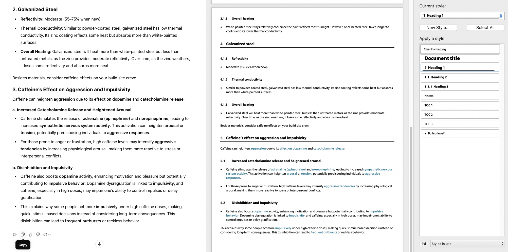

# ChatGPTtoWord

Convert your ChatGPT conversations to your own pre-defined Word styles with style, precision and automation. Minimum `Direct Formatting` in Word, maximum order and tidiness (my🇨🇭roots). Slice the “**• Bold:** Explanations” of ChatGPT into an easier to read and outline “Heading 3 + bullet point” form.

## Before and After Illustration



## Table of Contents

- [Introduction](#introduction)
- [Features](#features)
- [Requirements](#requirements)
- [Installation](#installation)
- [Setup](#setup)
- [Usage](#usage)
- [Advanced Tips](#advanced-tips)
- [Contributing](#contributing)
- [License](#license)

## Introduction

**ChatGPTtoWord** (also known as `ChatGPTtoRTF` to the connoisseurs) is a Node.js JavaScript single-file utility that grabs the ChatGPT Markdown output from your clipboard (when you press OpenAI’s `Copy` button), converts it to the RTF format, and auto-matches it to your predefined Word styles (md to Word mapping which you can customize).

I also split “Prefixed With Bold:” bullet points that ChatGPT likes to create, such as:

- **The Ultimate Knowledge**: is never final, but undergoing epistemic inquiry…

into separate `H3` and `bullet points`. Easier to read and ready for the automatic multilevel TOC at the top of your Word document as well.

The script also supports **bold** highlights, header hierarchy (up to 6 levels deep, but I haven’t seen ChatGPT dive lower than `H3`), inline `code`…

A bit of aesthetics for anyone who cares about visual structure, legibility, design… or anyone who likes to tame the information overload mess.

## Features

- converts Markdown to Word-compatible RTF format
- maps headings, lists, and styles directly to Word-defined formats
- changes US-style `Title Case` into `Sentence case` more common in multilingual documents we use elsewhere on this planet (yes, again my case of a trilingual), while preserving acronyms (like LLM, USM or KVM)
- auto-copies converted RTF directly to your clipboard, overwriting previous Markdown, for immediate pasting into Word
- offers customizable RTF settings for fonts, colors to suit your preferences

## Requirements

- Node.js (v14+)
- Word with styles pre-defined to match the script configuration
- **[clipboardy](https://github.com/sindresorhus/clipboardy)** (npm package)

## Installation

> [!NOTE]
> If `Node.js` and `npm` aren’t your area of expertise, but you’d like the functionality, get in touch, and I’ll think of an automated installer.

Download the script (it’s just 1 [JS logic file](index.js) and 1 [package meta](package.json) JSON file) or clone this repo and navigate to the directory:

```bash
git clone https://github.com/anatolyivanov/ChatGPTtoWord.git
cd ChatGPTtoWord
npm install
```

Install the **clipboardy** package to enable automatic clipboard reading and writing:

```bash
npm install clipboardy
```

> [!NOTE]
> I prefer to use a global `-g` install of `npm` libraries into my `/usr/local/lib/node_modules` and add an alias to it instead, so that all projects are automatically up-to-date. I do test before upgrading. Much more common practice is to compartmentalize `npm` on a per-project basis. Choose whichever you prefer.

### File Overview

- **[index.js](index.js)** – the main script to convert Markdown to RTF and update clipboard content
- **[package.json](package.json)** – dependencies and basic info about this package
- **[docs/RTF_basics.md](docs/RTF_basics.md)** – an intro course of RTF _arcana_ (if you want to tinker)

## Setup

### 1. Define Styles in Word

This script maps specific Markdown elements to pre-set Word styles. I’m using the following styles in Word (but, again, you can change those in the config:

| Markdown Element | Word Style           | Description                        |
|------------------|----------------------|------------------------------------|
| Heading 1        | `Heading 1`          | Main section titles               |
| Heading 2        | `Heading 2`          | Subsection titles                 |
| Heading 3        | `Heading 3`          | Tertiary section titles           |
| Bullets          | `Bullets level 1`    | Basic bullet points               |
| Sub-Bullets      | `Bullets level 2`    | Secondary bullet points           |

### 2. Or adjust `RTF_STYLESHEET` in `index.js` if needed

The `RTF_STYLESHEET` section of [index.js](index.js) defines which Word styles the script will map to. If you use different style names, change them here.

You might want to read [docs/RTF_basics.md](docs/RTF_basics.md) for fancier customizations. The idea remains the same: OpenAI outputs rather peculiar Markdown, you get to match them to your preferred Word Styles (ideally in a template).

The sky is the limit. Make it beautiful and easy to read for _you_.

## Usage

### Quick Start

1. **Copy your ChatGPT Markdown output to your clipboard.**
2. **Run the script**:
   ```bash
   node index.js
   ```
3. **Paste into Word** – Your ChatGPT markdown should now be pasted in your Word document, formatted with your predefined styles (`use destination styles`), requiring minimal touch-up.

### Add Shortcut (Optional)

To speed up the workflow, add a shortcut to run this script directly from the terminal:

#### Bash / ZSH

1. Open your shell profile file:
   ```bash
   nano ~/.bashrc  # or ~/.zshrc for ZSH users
   ```
2. Add an alias:
   ```bash
   alias gpt2word="node ~/path_to_your_script/index.js"
   ```
3. Save and reload the profile:
   ```bash
   source ~/.bashrc  # or ~/.zshrc for ZSH users
   ```
4. Run the script anytime with:
   ```bash
   gpt2word
   ```

## Advanced Tips

### Enable Debugging

Set `bool_Debug` to `true` in [index.js](index.js) to log both the original Markdown and the RTF output to the console before it updates your clipboard. Observe how Markdown converts to RTF.

### Customize Colors and Fonts

Inside `RTF_COLOR_TABLE` and `RTF_FONT_TABLE`, you can modify fonts and colors to match your Word document’s aesthetic.

## Contributing

Contributions and feedback are welcome! Please fork the repository, make your changes, and submit a pull request.

## License

This project is licensed under the terms outlined in the repo.

---
